# 🦙 PolyLlama

## Dynamic, Multi-Instance Ollama Orchestration for Local AI Power

PolyLlama is an open source stack for running [Ollama](https://ollama.com) in advanced local and homelab environments. It **automatically detects your hardware**, intelligently groups GPUs, dynamically generates Docker Compose configs, and provides powerful routing, load balancing, and monitoring for LLM workloads.

> PolyLlama makes it trivial to harness all your GPUs and CPUs for generative AI—no manual configuration required.

---

## 🏗️ Dynamic Architecture

PolyLlama **discovers your system’s capabilities** and generates the optimal deployment—whether you have a single GPU, a mixed multi-GPU workstation, or a humble CPU-only server.

### 🎯 **Automatic GPU Detection & Grouping**

* **Detects all NVIDIA GPUs** via `nvidia-smi` (using consistent PCI bus ordering)
* **Groups identical GPU models** together for maximal efficiency
* **Creates dedicated Ollama instances** per group, auto-setting `CUDA_VISIBLE_DEVICES`
* **Generates** `generated-compose.yml` on-the-fly using a Jinja2 template

### 📊 **Example Configurations**

#### Multi-GPU Workstation

```mermaid
graph TB
    subgraph "Hardware Detection"
        GPU0["🎮 RTX 4090<br/>GPU 0"]
        GPU1["🎮 RTX 4090<br/>GPU 1"] 
        GPU2["🎮 RTX 4090<br/>GPU 2"]
        GPU3["🖥️ RTX 6000 Ada<br/>GPU 3"]
    end
    
    subgraph "PolyLlama Instances"
        P1["🦙 polyllama1<br/>RTX 6000 Ada<br/>GPU 3"]
        P2["🦙 polyllama2<br/>RTX 4090<br/>GPUs 0,1,2"]
    end
    
    subgraph "Load Balancer"
        Router["🔀 Nginx Router<br/>:11434"]
    end
    
    GPU3 --> P1
    GPU0 --> P2
    GPU1 --> P2
    GPU2 --> P2
    
    Router --> P1
    Router --> P2
    
    style P1 fill:#e1f5fe
    style P2 fill:#f3e5f5
    style Router fill:#fff3e0
```



#### Gaming Laptop

```mermaid
graph TB
    subgraph "Hardware Detection"
        GPU0["🎮 RTX 4070<br/>GPU 0"]
    end
    
    subgraph "PolyLlama Instance"
        P1["🦙 polyllama1<br/>RTX 4070<br/>GPU 0"]
    end
    
    subgraph "Load Balancer"
        Router["🔀 Nginx Router<br/>:11434"]
    end
    
    GPU0 --> P1
    Router --> P1
    
    style P1 fill:#e8f5e8
    style Router fill:#fff3e0
```



#### CPU-Only System

```mermaid
graph TB
    subgraph "Hardware Detection"
        CPU["💻 CPU Only<br/>No GPUs Detected"]
    end
    
    subgraph "PolyLlama Instance"
        P1["🦙 polyllama1<br/>CPU Mode<br/>16GB Memory"]
    end
    
    subgraph "Load Balancer"
        Router["🔀 Nginx Router<br/>:11434"]
    end
    
    CPU --> P1
    Router --> P1
    
    style P1 fill:#fce4ec
    style Router fill:#fff3e0
```



---

## 🚀 Quick Start

### 1. **Clone the Repo**

```bash
git clone https://github.com/your-org/polyllama.git
cd polyllama
```

### 2. **Run the Launch Script**

```bash
# Auto-detect hardware and launch
./polyllama.sh

# See detected configuration
./polyllama.sh --detect

# Stop all services
./polyllama.sh --stop

# View logs
./polyllama.sh --logs

# Check status
./polyllama.sh --status
```

* **Dynamic Detection:**

  * *Multiple GPU types:* Each group gets its own instance
  * *Single GPU type:* All GPUs pooled for one instance
  * *No GPUs:* CPU-only Ollama
  * *Generates* `generated-compose.yml` dynamically

---

## 🌐 Access Points

* **Model Management Web UI**: [http://localhost:11434/ui/](http://localhost:11434/ui/)
* **Open Web UI (for local testing)**: [http://localhost:5000/](http://localhost:5000/)
* **API Endpoint**: [http://localhost:11434/api/](http://localhost:11434/api/)
* **Olah Mirror (for more efficient multi container HF downloads)**: [http://localhost:8090/](http://localhost:8090/)

---

## ✨ Features

* **Auto Hardware Discovery** (NVIDIA/CPU)
* **Dynamic Instance Grouping** (per GPU model)
* **Intelligent Model Routing & Load Balancing**
* **Context-Aware Model Loading**
* **Customizable via .env**
* **Modern Web UI for Monitoring & Management**
* **Nginx Proxy for Scalable Access**
* **Scripted Health Checks and Real-Time Status**

---

## 🖥️ Web Interface

* See all PolyLlama/Ollama instances, GPUs, and loaded models
* One-click model load/unload
* Set custom context lengths and manage assignments
* Visualize routing and system status live

---

## 🔧 Configuration

**Copy the `.env.example` to `.env` and set:**

```bash
HF_TOKEN=<your_hf_token>  # HuggingFace token for model access
```

---

## 📊 Monitoring & Management

* **Health:** Real-time status for all PolyLlama instances
* **Resource Usage:** GPU/CPU memory, model assignments
* **Load Balancing:** Least-connections with failover
* **Logs & Debugging:** Scripted helpers and Compose logs

---

## 🛠️ Advanced Usage

* **Custom Model Loading:**
  Use the UI to load/unload models, set context, and assign to instances
* **Direct API:**
  Target automatic routing or force a specific instance via API

---

## 🐛 Troubleshooting

```bash
./polyllama.sh --status
./polyllama.sh --logs
docker-compose logs polyllama1    # View logs for a specific instance
docker run --rm --gpus all nvidia/cuda:11.0-base nvidia-smi
docker exec polyllama1 nvidia-smi # Check GPU access in running instance
```

**Reset Everything:**

```bash
./polyllama.sh --stop
docker system prune -f
./polyllama.sh
```

---

## 🤝 Contributing

PolyLlama is **open source** and welcomes community involvement!

* **Code contributions** (detection logic, new features, UI)
* **Docs & How-tos**
* **Bug reports & feature requests**
* **Testing on unique hardware**
* **LLM-based UX helpers**

Want to get involved? [Open an issue](https://github.com/mode3cloud/polyllama/issues) or [start a discussion](https://github.com/mode3cloud/polyllama/discussions)!

---

## 🛣️ Roadmap & Potential Future Ideas

Some cool directions PolyLlama could go next:

* **LLM-powered Config Wizard:**
  Use an LLM to interpret your hardware, usage goals, and preferences to generate an ideal configuration (including model placement, memory tuning, and advanced routing).
* **AMD & Apple GPU Support:**
  Expand beyond NVIDIA via ROCm/Metal backends as supported by Ollama and the community.
* **Unified Model Marketplace:**
  Integrated access to community models, HuggingFace, and private model hubs.
* **More Granular Model Pinning:**
  Assign specific models or jobs to preferred GPU classes or nodes.
* **User Profiles & Access Control:**
  Fine-tune who can manage or use PolyLlama.
* **Cluster/Networked Mode:**
  Deploy PolyLlama across several physical nodes (for true AI at scale).
* **Metrics & Alerting Integrations:**
  Prometheus/Grafana or Discord/Slack bots for real-time health alerts.
* **Self-Updating Stack:**
  Automated update flow for the full system (including dependencies).

Have ideas or want to help build the next phase? **Contributions are encouraged!**

---

## License

[MIT License](LICENSE)

---

## Credits

PolyLlama is built on the excellent [Ollama](https://ollama.com) open source project, and includes [Open WebUI](https://github.com/open-webui/open-webui) for ease of testing and [Olah](https://github.com/vtuber-plan/olah) to reduce multiple model downloads.

🦙🦙🦙 Thanks to all AI and open hardware enthusiasts whose work makes local AI possible! 🦙🦙🦙

---

*Let the llamas run wild on your silicon.*
— The PolyLlama Team

---
